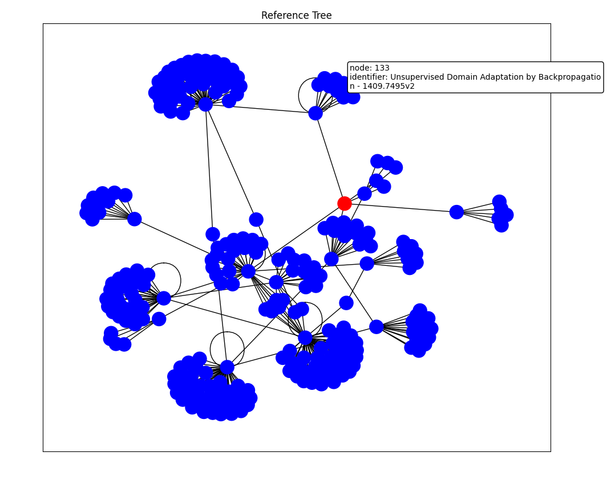

## Arxiv-Tree

Recursively downloads the references (and the references of the references (and ...)) of a paper. Useful for briefly reviewing the subject matter or background of a paper.

results for asynchronous, multithreaded download:

`$ time python main.py --limit 1 --title`   

`8.66s user 0.65s system 14% cpu 1:05.62 total`

results for synchronous, singlethread download:

`$ time python main.py --limit 1 --title`

`6.00s user 0.84s system 1% cpu 5:57.44 total`

Results plot:

